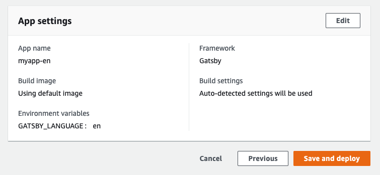
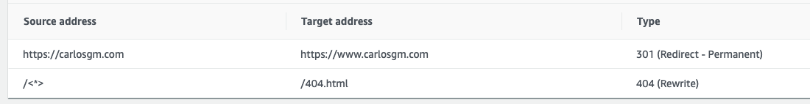

In this article I will explain how to easily create a static site with multi-language support using [Gatsby](https://gatsbyjs.com) and [AWS Amplify](https://aws.amazon.com/amplify/). These are the steps that I have followed to create this very same blog. You will require to [have an AWS account](https://aws.amazon.com/account) and you will need to have [NodeJS](http://nodejs.org) installed.

<!-- start -->

# Creating a Gatsby site

First of all you will need to create a Gatsby site. Gatsby offers both a [quick start guide](https://www.gatsbyjs.com/docs/quick-start/) and a [tutorial](https://www.gatsbyjs.com/tutorial/) on how to do this. Build your site first in your main language and add some content to it.

Once you are more or less happy with your site locally (you will be able to make as improvements as needed in the future), push it to a Git repository that can be accessed externally, ideally on [Github](https://github.com) or [Bitbucket](https://bitbucket.org/).

# Hosting your site on AWS Amplify

Log into your AWS console and use the dropdown to find AWS Amplify, you should see the title `Get started with the Amplify Console` (if not, click on the `Connect App` button). Select the service you used to host your code, click `Continue` and log into the service.


Select the repository and branch where you have your code. AWS Amplify will detect that you are going to host a Gatsby site and do all the heavy lifting for you, but you might want to change the app name.

By default, the app name will be the same that your repo, but since we will be creating one app for each language I would recommend adding some identifier for each language, for instance `en__myapp` or `myapp-gb_en`.

Click on `Advanced settings` and within `Environment variables` create a new variable with the key `GATSBY_LANGUAGE` and a value that identifies the default language you are using so far. I would recommend using an [ISO Code that identifies the language](https://en.wikipedia.org/wiki/List_of_ISO_639-1_codes).

Click `Next`, and review all the details, paying attention to the `App name` and the `Environment variables` identifying correctly the language of your new site. When you are happy press `Save and deploy`.



If everything goes well you should have your Gatsby site hosted and deployed on AWS Amplify and you should have an URL to access it.

Before moving to the next step it is important that you go to `App settings -> Rewrites and redirects` and review that the only redirects are from the website without `www.` to the website with `www.` and from `/<*>` to `/404.html`. If this is not the case click `Edit` and change the redirects to match this, below is an example of the configuration for this site.



# Modifying our site to support a second language

The environment variable that we just created will be useful in order to identify the correct language within our site. This will be useful towards:

-   enabling switching from one language to another;
-   serving content in the correct language.

Before you do any of this you should create a `.env.development` file in the root of your Gatsby site and write in it your `GATSBY_LANGUAGE` variable. It should look like the following:

```
GATSBY_LANGUAGE=en
```

But with your language code instead of `en`. You will need to reload gatsby every time you change this variable will you develop. Now we are ready to implement our second language.

## Serving content in the correct language

We will need to tag the language of our content. In this example we will use Markdown, but probably you can follow a similar approach no matter how you create and serve your content.

At the beginning of your content create a [frontmatter](https://www.gatsbyjs.com/docs/adding-markdown-pages/#frontmatter-for-metadata-in-markdown-files) entry with the key `language` and the same value that you used for your environment variable to identify the language, for instance `en`.

As an example, the frontmatter for this very same post document is:

```
---
title: 'Creating and hosting a multilanguage site with Gatsby and AWS Amplify'
language: en
---
```

(I have added some other keys, not all relevant for the purposes of this tutorial although they can help you to extend your internationalisation as we will see by the end of this post.)

The next step is filtering the language to create only pages for the posts relevant to the language. We will assume that you have followed the Gatsby guide and that you have already completed the [part about programatically creating pages from Markdown data](https://www.gatsbyjs.com/tutorial/part-seven/).

If that is the case, you should have a `gatsby-node.js` file with an `exports.createPages` function that should be doing a graphql query to retrieve all the markdown remark nodes.

You should modify the query to filter by those nodes which frontmatter language matches our `process.env.GATSBY_LANGUAGE` at build time. Below is an example of such query.

```js
const result = await graphql(`
        query {
            allMarkdownRemark(filter: {frontmatter: {language: {eq: "${process.env.GATSBY_LANGUAGE}"}}}) {
                edges {
                    node {
                        fields {
                            slug
                        }
                    }
                }
            }
        }
    `);
```

If you followed the Gatsby guide you should also have a `src/templates/blog-post.js` file. I would recommend creating a `LanguageContext` to pass the language information that you might need to all the components.

Your `blog-post.js` should look similar to the following:

```jsx
import React, { createContext } from 'react';
import { graphql } from 'gatsby';
import Layout from '../components/layout';
const defaultState = {
    language: 'en',
};
const LanguageContext = React.createContext(defaultState);
export { LanguageContext };
export default function BlogPost({ data }) {
    const post = data.markdownRemark;
    return (
        <LanguageContext.Provider
            value={{ language: post.frontmatter.language }}
        >
            <Layout>
                <div>
                    <h1>{post.frontmatter.title}</h1>
                    <div dangerouslySetInnerHTML={{ __html: post.html }} />
                </div>
            </Layout>
        </LanguageContext.Provider>
    );
}
export const query = graphql`
    query($slug: String!) {
        markdownRemark(fields: { slug: { eq: $slug } }) {
            html
            frontmatter {
                title
                language
            }
        }
    }
`;
```

## Switching between languages

Start planning your strategy to serve content in two different languages, you can go for:

1. Completely separate TLDs (this is the case of this blog, with the `.com` serving English language and the `.es` serving Spanish language)
2. Separate subdomains (for instance, with http://en.example.com serving English language and http://pt.example.com serving Portuguese language)
3. Using a subfolder (eg. http://www.example.com/en/ for English and http://www.example/fr/ for French)

It is completely up to you which strategy to use, there are different arguments regarding SEO and marketing but in the end I would recommend to use the first strategy if you have different domain availables or the second one if you do not.

Create a new component that you will embed in the header. Remember the `LanguageContext` that we created in `blog-post.js`? You should be able to import that context in this new component to make decisions about in which language we are at the moment.

For example:

```jsx
import React, { useContext } from 'react';

import { LanguageContext } from '../../templates/blog-post';

const LanguageSwitch = () => {
    const { language } = useContext(LanguageContext);
    if (language === 'es') {
        return <a href="http://en.example.com">Switch to English</a>;
    }
    return <a href="http://es.example.com">Leer en Español</a>;
};

export default LanguageSwitch;
```

You can mimic this pattern in any other component (eg. `SEO`) to make decisions regarding the language and display different content or logic depending on the current language.

# Creating your second app with a different language

From here it should be trivial to create new apps on AWS Amplify with any new language that you want to create. Go to your AWS Amplify console and click again on `Connect app`, connect to the same repository (you should see a warning that the repository is already connected to an app) and make sure that this time you give your app a name that matches the new language and that you create a `GATSBY_LANGUAGE` environment variable that matches your second language.

Once you have deployed the new app, Gatsby will pick up any environment variable prefixed with `GATSBY_` and use our `GATSBY_LANGUAGE` variable to build the pages for the relevant language.

Finally you should configure your domain and

# SEO and further improvements

Make sure you update your SEO component and that the title and meta descriptions make sense in the corresponding language. Simply consume the LanguageContext to serve the correct content.

Another improvement is to link to the appropriate page if the page is translated. For this you can create a `translated` frontmatter entry in your Markdown or a similar approach, query it in your graphql and use it to generate the link. This post should have already given you enough clues on how to do this.

There are many other improvements that can be made (for instance, consuming the base url from an environment variable rather than hardcoding it), but hopefully after this post you will have a good starting point. Good luck!
