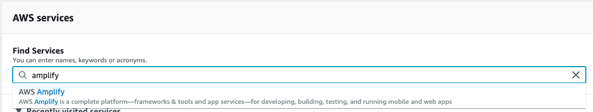
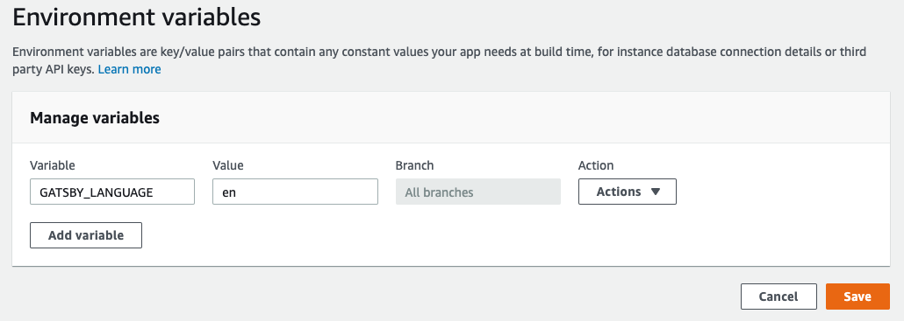

In this article I will explain how to easily create a static site with multi-language support using [Gatsby](https://gatsbyjs.com) and [AWS Amplify](https://aws.amazon.com/amplify/). These are the steps that I have followed to create this very same blog. You will require to [have an AWS account](https://aws.amazon.com/account) and you will need to have [NodeJS](http://nodejs.org) with npm installed.

<!-- start -->

# Creating a Gatsby site

First of all you will need to create a Gatsby site. Gatsby offers both a [quick start guide](https://www.gatsbyjs.com/docs/quick-start/) and a [tutorial](https://www.gatsbyjs.com/tutorial/) on how to do this. Build your site first in your main language and add some content to it.

Once you are more or less happy with your site locally (you will be able to make as improvements as needed in the future), push it to a Git repository that can be accessed externally, ideally on [Github](https://github.com) or [Bitbucket](https://bitbucket.org/).

# Hosting your site on AWS Amplify

Log into your AWS console and use the dropdown to find AWS Amplify, you should see the title `Get started with the Amplify Console` (if not, click on the `Connect App` button). Select the service you used to host your code, click `Continue` and log into the service.



Select the repository and branch where you have your code. AWS Amplify will detect that you are going to host a Gatsby site and do all the heavy lifting for you, but you might want to change the app name.

By default, the app name will be the same that your repo, but since we will be creating one app for each language I would recommend adding some identifier for each language, for instance `en__myapp` or `myapp-gb_en`. Once you are happy press `Next`, review all the details and when you are happy press `Save and deploy`.

If everything goes well you should have your Gatsby site hosted and deployed on AWS Amplify and you should have an URL to access it.

While you are still on `AWS Amplify` go to `Environment variables` and add a new environment variable. Name the variable `GATSBY_LANGUAGE` and enter a value that identifies the default language you are using so far. I would recommend using an [ISO Code that identifies the language](https://en.wikipedia.org/wiki/List_of_ISO_639-1_codes).



# Modifying our site to support a second language

The environment variable that we just created will be useful in order to identify the correct language within our site. This will be useful towards:
* enabling switching from one language to another;
* serving content in the correct language.

Before you do any of this you should create a `.env.development` file in the root of your Gatsby site and write in it your `GATSBY_LANGUAGE` variable. It should look like the following:

```
GATSBY_LANGUAGE=en
```
But with your language code instead of `en`. You will need to reload gatsby every time you change this variable will you develop. Now we are ready to implement our second language.

## Switching between languages

You will need to create a custom component.

## Serving content in the correct language

Your content should be tagged and you should filter it.

# Creating your second app

Create a second app in AWS Amplify with the new variable.

## Create as many languages as you want

# SEO and further improvements

Make sure all your meta are in the correct language depending on env variable.
