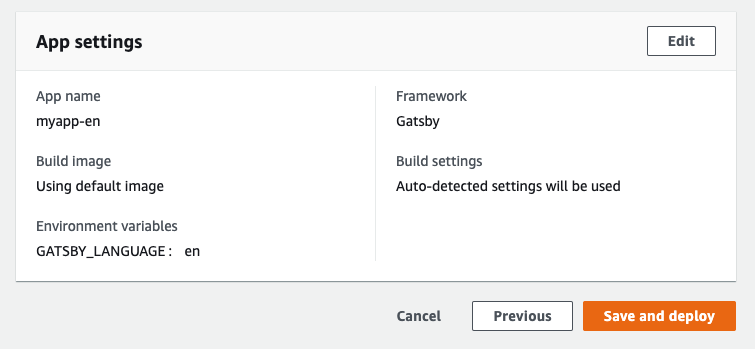
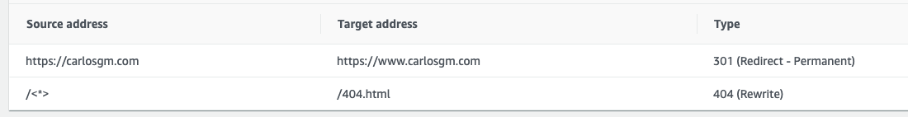

En este artículo explicaré como crear fácilmente un sitio estático con varios idiomas usando [Gatsby](https://gatsbyjs.com) y [AWS Amplify](https://aws.amazon.com/amplify/). Estos son los mismos pasos que he seguido para crear este blog. Necesitarás una [cuenta de AWS](https://aws.amazon.com/account) y deberás tener [NodeJS](http://nodejs.org) con npm instalado.

<!-- start -->

# Creando un sitio web con Gatsby

Lo primero es que crees un sitio web usando Gatsby. Gatsby tiene en su web una [guía rápida](https://www.gatsbyjs.com/docs/quick-start/) y un [tutorial completo](https://www.gatsbyjs.com/tutorial/) sobre como hacer esto. Crea tu sitio primero en el idioma principal que vayas a usar.

Ua vez estés maás o menos contento con cómo se ve tu sitio en tu ordenador (podrás hacer más modificaciones en el futuro, no te preocupes), haz `push`a un repositorio git remoto que se pueda acceder desde AWS, idealmente en [Github](https://github.com) o [Bitbucket](https://bitbucket.org/).

# Alojando tu sitio en AWS Amplify

Inicia sesión en tu consola de AWS y usa el buscador para encontrar Amplify, deberías ver el título `Get started with the Amplify Console` si es tu primer sitio en Amplify (y si no, haz click en `Connect App`). Selecciona en el servicio que utilizaste para alojar tu repositorio git, haz click en `Continue` e identifícate con dicho servicio.


Selecciona el respositorio y la _branch_ donde tienes tu código. AWS Amplify detectará automáticamente que vas a alojar un sitio Gatsby y hará todo el trabajo duro por ti, pero deberemos hacer un par de cambios.

Por defecto, el nombre de la app será el mismo nombre que el de tu repositorio, pero desde que estaremos creando una app para cada idioma desde el mismo repositorio, recomendaría añadir algún identificador en el nombre para cada idioma, por ejemplo `es__myapp` o `myapp-es_es`.

Haz clic en `Advanced settings` y denntro de `Environment variables` crea una nueva variable con key `GATSBY_LANGUAGE` y con un valor que identifique el idioma que estás usando. Te recomiendo usar un [código ISO que se corresponda al idioma utilizado](https://es.wikipedia.org/wiki/ISO_639-1).

Haz clic en `Next` y da un último vistazo a todos los valores, prestando especial atención en que tanto en `App name` como en `Environment variables` tenemos los valores adecuados. Haz clic en `Save and deploy`.



Si todo funciona como debe deberías ver tu sitio Gatsby alojado y desplegado en AWS Amplify y Amplify debería haberte proporcionado una URL para verificarlo.

Antes de continuar, asegúrate de que Amplify no ha creado redirecciones extrañas. Vete a `App settings -> Rewrites and redirects` y revisa  que las únicas redirecciones son desde el sitio sin `www.` al sitio con `www.` y desde `/<*>` a `/404.html`. Si este no es el caso haz clic en `Edit` y cambia las redirecciones. Abajo te dejo un ejemplo de las redirecciones de este sitio.



# Añadiendo un segundo idioma a nuestro sitio

La variable de entorno (_env var_ de ahora en adelante) que acabas de crear nos será útil para identificar el idioma correcto de nuestro sitio. Esto te permitirá:
- presentar el contenido adecuado,
- cambiar de un idioma a otro.

Antes de que hagamos nada de esto deberías crear un archivo llamado `.env.development`en la raíz de tu proyecto Gatsby y escribir en él la _env var_ que vas a utilizar durante el desarrollo. Su contenido debería ser el siguiente:

```
GATSBY_LANGUAGE=en
```

Utilizando el código de idioma que has seleccionado en vez de `en`. Deberás detener y arrancar el modo de desarrollo de Gatsby cada vez que cambies esta variable. Ahora estamos listos para implementar otro idioma.

## Presentando contenido en el idioma adecuado

Deberemos identificar el idioma de nuestro contenido. En este post utilizaremos Markdown, pero probablemente puedes seguir un enfoque similar sin importar de que forma gestiones tu contenido.

Al principio de tu documento Markdown crea una entrada [frontmatter](https://www.gatsbyjs.com/docs/adding-markdown-pages/#frontmatter-for-metadata-in-markdown-files) con la clave `language`y el valor que has utilizado en tu _env var_ para identificar el idioma, por ejemplo `es`.

Como ejemplo, el frontmatter de este post es:

```
---
title: 'Como crear un sitio multi-idioma usando Gatsby y AWS Amplify'
language: es
---
```

(Este post tiene algunas otras claves frontmatter en realidad, pero no todas son importantes para este tutorial, aunque algunas pueden ayudarte a mejorar tu internacionalización en aspectos como SEO. Hablaremos de esto al final del post.)

El siguiente paso es filtrar el idioma para crear páginas sólo para el contenido relevante al idioma del sitio. Asumiremos que has seguido la guía de Gatsby y que ya has completado la [parte siete sobre como crear páginas de forma programática](https://www.gatsbyjs.com/tutorial/part-seven/).

Si este es el caso, deberías tener un archivo `gatsby-node.js` con una función `exports.createPages`que debería hacer una consulta graphql para obtener todos los nodos markdown.

Modifica esta consulta para filtrar aquellos nodos cuyo lenguaje en frontmatter coincida con nuestra variable de entorno `process.env.GATSBY_LANGUAGE`, a continuación tienes un ejemplo de dicha consulta:

```js
const result = await graphql(`
        query {
            allMarkdownRemark(filter: {frontmatter: {language: {eq: "${process.env.GATSBY_LANGUAGE}"}}}) {
                edges {
                    node {
                        fields {
                            slug
                        }
                    }
                }
            }
        }
    `);
```

Si seguiste la guía de Gatsby también deberías tener un archivo `src/templates/blog-post.js`. Mi recomendación es que crees un contexto de React llamado `LanguageContext` para pasar información sobre el idioma a todos los componentes.

Tu `blog-post.js` debería tener la siguiente pinta:

```jsx
import React, { createContext } from 'react';
import { graphql } from 'gatsby';
import Layout from '../components/layout';
const defaultState = {
    language: 'en',
};
const LanguageContext = React.createContext(defaultState);
export { LanguageContext };
export default function BlogPost({ data }) {
    const post = data.markdownRemark;
    return (
        <LanguageContext.Provider
            value={{ language: post.frontmatter.language }}
        >
            <Layout>
                <div>
                    <h1>{post.frontmatter.title}</h1>
                    <div dangerouslySetInnerHTML={{ __html: post.html }} />
                </div>
            </Layout>
        </LanguageContext.Provider>
    );
}
export const query = graphql`
    query($slug: String!) {
        markdownRemark(fields: { slug: { eq: $slug } }) {
            html
            frontmatter {
                title
                language
            }
        }
    }
`;
```

## Cambiado de un idioma a otro

Empieza a planear tu estrategia para presentar contenido en varios idiomas distintos, puedes:
1. Utilizar dominios completamente distintos (este es el caso de este blog, con `.com` presentando el contenido en inglés y `.es`el contenido en español).
2. Utilizar subdominios (por ejemplo, usando http://en.example.com para el inglés y http://pt.example.com para el portugués).
3. Utilizar una subruta (p.e.: http://www.example.com/en/ para el inglés y http://www.example/fr/ para el francés).

Es tu decisión qué estrategia usar, encontrarás por Internet distintos argumentos en lo relativo al SEO y el márketing para utilizar una u otra; pero mi recomendación es que utilices la primera si tienes varios dominios relacionados disponibles y si no la segunda.

Crea un nuevo componente que consumiremos en nuestro Header (o en cualquier lugar en el que decidas presentar la opción para cambiar el idioma). ¿Recuerdas el contexto `LanguageContext` que creamos antes en `blog-post.js`? En este componente deberías ser capaz de importar dicho contexto para hacer decisiones lógicas relacionadas con el idioma.

Por ejemplo:

```jsx
import React, { useContext } from 'react';

import { LanguageContext } from '../../templates/blog-post';

const LanguageSwitch = () => {
    const { language } = useContext(LanguageContext);
    if (language === 'es') {
        return <a href="http://en.example.com">Switch to English</a>;
    }
    return <a href="http://es.example.com">Leer en Español</a>;
};

export default LanguageSwitch;
```

Puedes replicar este patrón en otros componentes (por ejemplo, en `SEO`) para hacer decisiones relacionadas con el idioma y presentar distinto contenido y lógica según el idioma en el que se encuentre el sitio.

# Creando otra app en Amplify con otro idioma

A partir de aquí debería ser relativamente trivial crear nuevas apps en AWS Amplify con cualquier idioma. Vete de nuevo a la consola de AWS Amplify y haz clic en `Connect app`, conecta el mismo repositorio (deberías ver una advertencia diciendo que ese repositorio ya está conectado a una app) y asegúrate de que cambias el nombre de la app y añades una variable de entorno `GATSBY_LANGUAGE` que se corresponda con el nuevo idioma que queremos presentar.

Una vez hayas desplegado tu app, Gatsby tendrá acceso a cualquier variable de entorno con el prefijo `GATSBY_` y utilizará la variable `GATSBY_LANGUAGE` para filtrar el contenido en el idioma adecuado.

Por último, deberías configurar tus dominios o subdominios en tus distintas apps de Amplify para que coincidan con los enlaces que creamos en nuestro componente para cambiar de idiomas. Ve a `App settings -> Domain management` y haz clic en `Add domain`. Sigue las instrucciones que dependerán de tu proveedor de dominios y crea también los subdominios que puedas necesitar dentro de Amplify.

# SEO y otras mejoras

Asegúrate de que tu componente SEO está actualizado y que presenta el título y las meta descripciones adecuadas según el idioma. Simplemente utiliza el `LanguageContext` que creamos para presentar el contenido adecuado.

Otra mejora que puedes hacer es enlazar a la página adecuada si dicha página en concreto está traducida. Para esto podrías crear una entrada frontmatter con la clave `translated` o con el código del otro idioma y añadir dicha entrada de frontmatter en nuestra consulta graphql. Este post debería haberte dado suficientes pistas sobre cómo hacer esto.

Se pueden hacer muchas más mejoras (por ejemplo, que en vez de incluir la URL en el código la consumas desde otra variable de entorno). Espero que este post te haya dado una buena base para crear un sitio web multi-lenguaje. ¡Mucha suerte!
